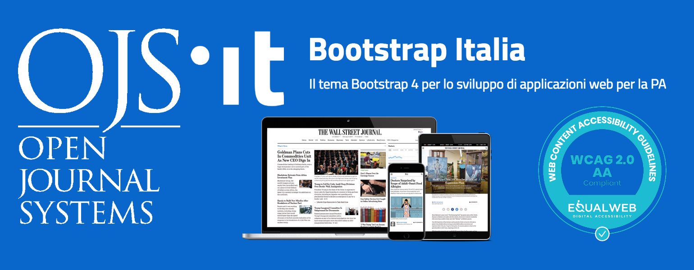

# Bootstrap Italia Theme for OJS 3

## Information
This is a custom parent theme for the OJS 3 release. It is based on Bootstrap Italia framework.

Developer: Abramo Tesoro, Simone Vecchi

## Current release
Current latest release is ready for production use

## How to use
1. Download the plugin.
2. Rename directory to the `bootstrapita`.
3. Copy to themes directory inside OJS.

## Licensing
The BootstrapItalia theme is licensed under GPLv3. 
